**Practical No. 01** 

**Aim: Implementation of Data Partitioning through Range and List Partitioning** 

1) **Range Partitioning** 
1. Create table sales with the following columns: 

|prod\_id |Number |
| - | - |
|cust\_id |Number |
|time\_id |Date |
|channel\_id |Char |
|promo\_id |Number |
|quantity\_sold |Number |
|amount\_sold |Number |

- Partition this table into 4 using range partition and time\_id as partitioning key. Give partition names as: 

  sales\_q1\_2006, sales\_q2\_2006, sales\_q3\_2006, sales\_q4\_2006. 

  **Query:** 

- create table sales( 

  prod\_id number(5), 

  cust\_id number(5), 

  time\_id date, channel\_id 

  char(5), promo\_id 

  number(5), 

  quantity\_sold number(5), 

  amount\_sold number(10)) 

  partition by range(time\_id) 

  (partition sales\_q1\_2006 values less than (to\_date('31-MAR-2006','dd-MON-yyyy')), partition sales\_q2\_2006 values less than (to\_date('31-MAY-2006','dd-MON-yyyy')), partition sales\_q3\_2006 values less than (to\_date('30-SEP-2006','dd-MON-yyyy')), partition sales\_q4\_2006 values less than (to\_date('31-DEC-2006','dd-MON-yyyy'))); 

  **Output: 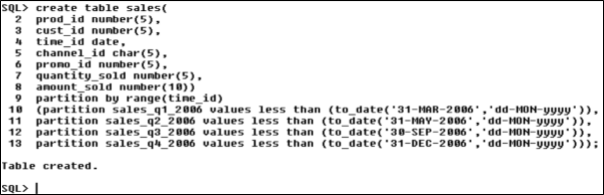**

- Store quarterly data into each partition. For example, partition sales\_q1\_2006 will store records for first quarter 01-jan-2006 to 01-mar-2006 sales\_q1\_2006 will store records for second quarter 01-apr-2006 to 01- jun2006. And so on. 

**Query:** 

- insert into  sales  values(2015,103,'15-Mar-2006',101,234,23,1029); 

  insert  into  sales  values(3013,204,'03-Apr-2006',103,456,56,2938); insert  into  sales  values(6016,302,'27-Jun-2006',105,567,43,3847); insert  into  sales  values(8101,404,'05-Aug-2006',204,678,95,4756); insert  into  sales  values(4106,501,'17-Nov-2006',206,789,62,2374); insert  into  sales  values(8014,603,'23-Feb-2006',303,901,83,6358); insert into sales values(2761,625,'13-Sep-2006',403,432,57,9341); 

  **Output:** 

  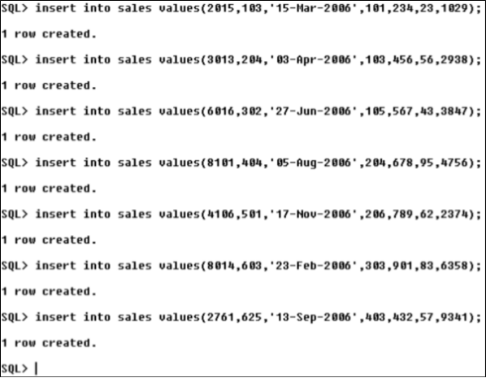

- Write a command to view records in each partition. **Query:** 
- select \*  from  sales  partition  (sales\_q1\_2006); 

  select  \*  from  sales  partition  (sales\_q2\_2006); select  \*  from  sales  partition  (sales\_q3\_2006); select \* from sales partition (sales\_q4\_2006); 

  **Output: 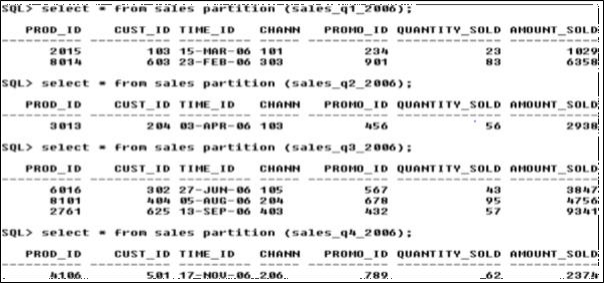**

- Write a command to display the partition structure. 

**Query:** 

- select table\_name,partition\_name,high\_value,num\_rows from 

user\_tab\_partitions where table\_name='SALES'; **Output: 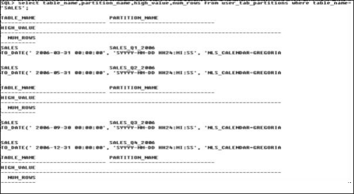**

- Write a command to add a new partition called sales\_q1\_2007 for the next quarter value. 

**Query:** 

- alter table sales add partition sales\_q1\_2007 values less than(TO\_DATE('31- MAR-2007','dd-MON-yyyy')); 

**Output: 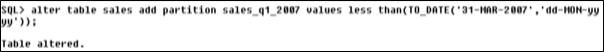**

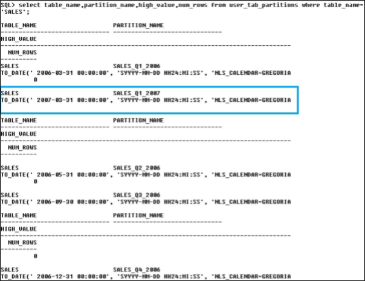

- Write a command to delete all records from partition sales\_q1\_2006. **Query:** 
- alter table sales truncate partition sales\_q1\_2006; 

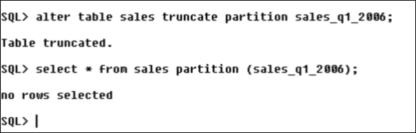

- Write a command to delete a partition. **Query:** 
- alter table sales drop partition sales\_q3\_2006; **Output:** 

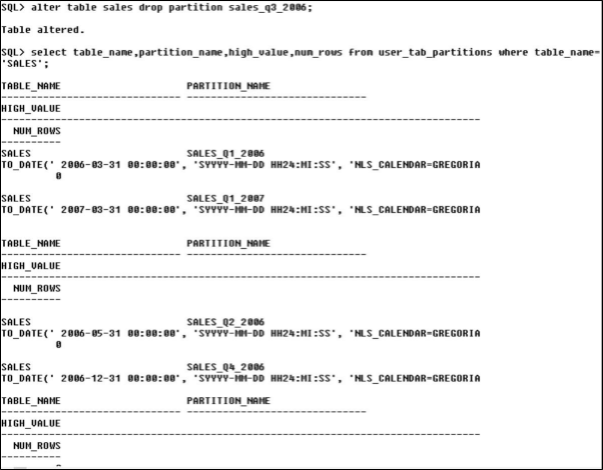

2) **List Partitioning** 
2. Create table Student with the following columns: 

|Student\_id |Number |
| - | - |
|Student\_name |Number |
|Student\_dob |Date |

- Create list partition with student\_name as partition key. Create following two partitions. 

  stu\_divA with values 'a','b','c','d','e','f','g','h','i','j','k' 

  stu\_divB with values 'n','o','p','q','r','s','t','u','v','w','x','y','z' **Query:** 

- create table Student( 

student\_id number(5), 

student\_name varchar2(20), 

student\_dob date) 

partition by list(student\_name) 

(partition stu\_divA values('a','b','c','d','e','f','g','h','i','j','k'), partition stu\_divB values('n','o','p','q','r','s','t','u','v','w','x','y','z')); 

**Output:** 

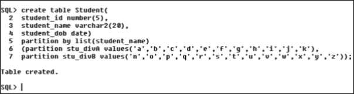

**Query:** 

- insert into Student values(0121,'m',to\_date('23-AUG-1963','dd-MON-yyyy')); 

  insert into Student values(0221,'j',to\_date('15-SEP-1958','dd-MON-yyyy')); insert into Student values(0321,'a',to\_date('19-AUG-1992','dd-MON-yyyy')); insert into Student values(0421,'h',to\_date('10-JUL-1991','dd-MON-yyyy')); insert into Student values(0521,'p',to\_date('27-JUN-1965','dd-MON-yyyy')); insert into Student values(0621,'z',to\_date('18-MAR-1968','dd-MON-yyyy')); 

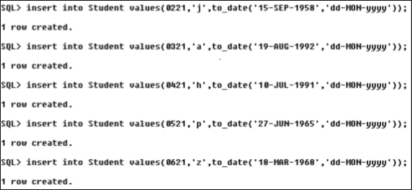

- Write a command to view records in each partitions. **Query:** 
- select \* from Student partition(stu\_divA); 

  select \* from Student partition(stu\_divB); **Output:** 

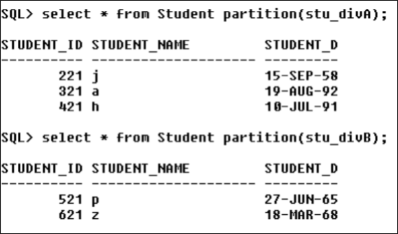

- Write a command to display the partition structure. **Query:** 
- SELECT TABLE\_NAME, PARTITION\_NAME,HIGH\_VALUE, NUM\_ROWS FROM 

  USER\_TAB\_PARTITIONS 

  WHERE TABLE\_NAME='STUDENT'; 

  **Output:** 

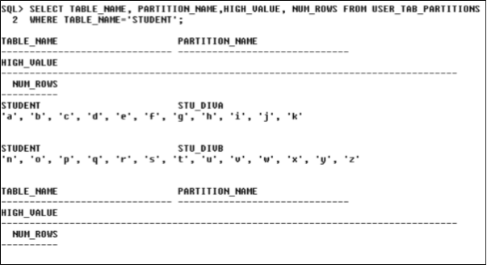

- Write a command to add a new partition called stu\_null for the null values. **Query:** 
- alter table student add partition stu\_null values(NULL); **Output:** 

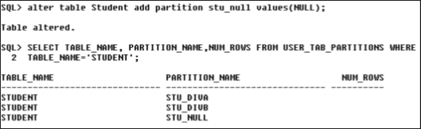

- Write a command to display records from stu\_null partition. **Query:** 
- select \* from Student partition(stu\_null); **Output:** 

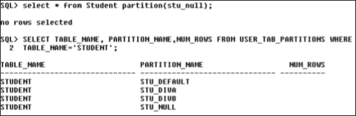

- Write a command to add a new partition called stu\_default for the default 
- values. 

  Write a command to display records from stu\_default partition. **Query:** 

- alter table Student add partition stu\_default values(DEFAULT); 
- select \* from Student partition(stu\_default); 

  **Output:** 

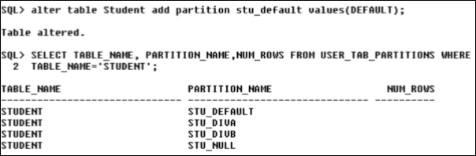

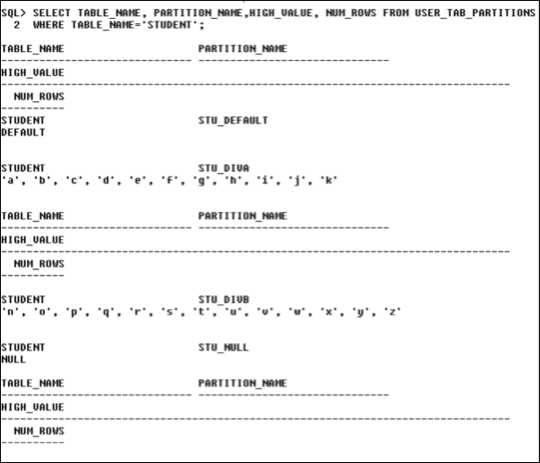

- Write a command to add values ‘l’ and ‘m’ in a partition stu\_divA 

  **Query:** 

- alter table Student modify partition stu\_divA add values('l','m'); 

  **Output:** 

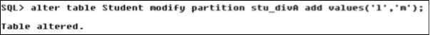

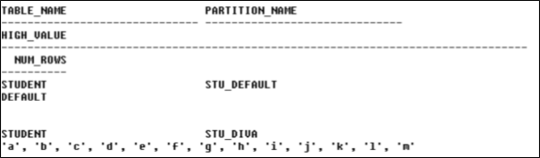

- Write a command to display records from stu\_divA partition. 

  **Query:** 

- select \* from Student partition(stu\_divA); 

  **Output:** 

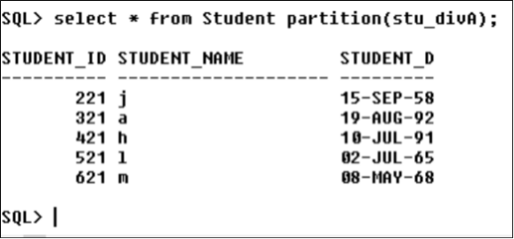

**Practical No. 3** 

**Aim: Implementation of Analytical Queries like Roll\_Up, CUBE, First, Last, Lead, Lag, Row\_number, Rank and Dense Rank.** 

- Creating a Table: Employee Table and Inserting values in the Table. **Query:** 
- create table Employee( 

EmpNo number(6), Name varchar(10), Position varchar(6), Manager number(6), JoinDate date, Salary number(7), DeptNo number(3)); 

- insert into Employee values(1632,’Sam’,’Asstt’,131632,to\_date(‘9-6-1963’,’dd-mm- 

yyyy’),11370,102); 

insert into Employee values(1461,’Lark’,’Asstt’,131461,to\_date(‘2-4-1965’,’dd-mm- yyyy’),25410,203); 

insert into Employee values(2345,’Herman’,’Oficer’,130245,to\_date(‘19-4-1978’,’dd- mm-yyyy’),37520,102); 

insert into Employee values(2893,’Daniel’,’Oficer’,131461,to\_date(‘3-12-1988’,’dd- mm-yyyy’),8230,203); 

insert into Employee values(5845,’Park’,’Mngr’,130245,to\_date(‘17-12-1991’,’dd- mm-yyyy’),45840,203); 

insert into Employee values(6459,’Muel’,’Mngr’,131461,to\_date(‘20-2-1993’,’dd- mm-yyyy’),64559,304); 

insert into Employee values(7583,’Shane’,’SrMngr’,130245,to\_date(‘22-2-1995’,’dd- mm-yyyy’),77580,304); 

insert into Employee values(9534,’Murr’,’SrMngr’,131632,to\_date(‘25-2-1989’,’dd- mm-yyyy’),95450,304); 

**Output:** 

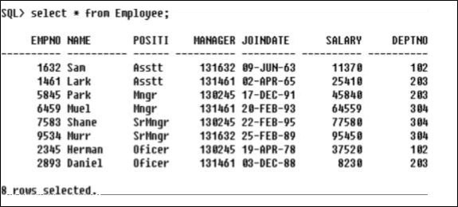

- **Roll\_Up Syntax:**
- select c1, c2, aggregate\_function(c3) 

from table\_name 

GROUP BY ROLLUP (c1, c2); 

- **Roll\_Up** is a modifier used to produce the summary output, including extra 

rows that represent super-aggregate (higher-level) summary operations. It enables us to sum-up the output at multiple levels of analysis using a single query. 

**Query:** 

- Without RollUp: 

  select DeptNo, sum(Salary) as Total from Employee group by DeptNo 

  order by DeptNo; 

  **Output:** 

  ![ref1]

- With RollUp: 

  select DeptNo, sum(Salary) as Total from Employee group by rollup(DeptNo) order by DeptNo; 

  **Output:** 

  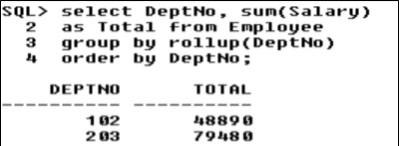

- Multiple Column without RollUp: 

  select DeptNo, Position, sum(Salary) as Total from Employee 

  group by DeptNo, Position 

  order by 1,2; 

  **Output:** 

  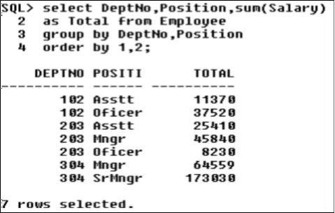

- Multiple Column with RollUp: 

  select DeptNo, Position, sum(Salary) as Total from Employee 

  group by rollup(DeptNo, Position) order by 1,2; 

  **Output:** 

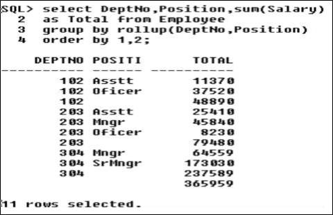

- **CUBE Syntax:** 
- select c1, c2, aggregate\_function(c3) 

from table\_name 

GROUP BY CUBE (c1, c2); 

- **CUBE** is an extension similar to ROLLUP, enabling a single statement to 

calculate all possible combinations of subtotals. CUBE can generate the information needed in cross-tab reports with a single query. 

**Query:** 

- Without CUBE: 

  select DeptNo, sum(Salary) as Total from Employee group by DeptNo 

  order by DeptNo; 

  **Output:** 

  ![ref1]

- With CUBE: 

  select DeptNo, sum(Salary) as Total from Employee group by cube(DeptNo) order by DeptNo; 

  **Output:** 

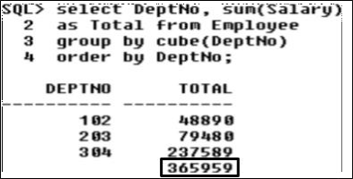

- Multiple Column without Cube: 

  select DeptNo, Position, sum(Salary) as Total from Employee 

  group by DeptNo, Position 

  order by 1,2; 

  **Output:** 

  

- Multiple Column with Cube: 

  select DeptNo,Position,sum(Salary) as Total from Employee 

  group by cube(DeptNo,Position) order by 1,2; 

  **Output:** 

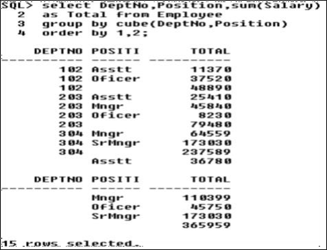

- **Rank Syntax:** 
- select c1, c2, c3 rank() 

  over(order by c1) RANK from table\_name; 

- **Rank** function assigns a rank to each row within a partition such that each row’s 

rank is one more than total number of rows that have been ranked in that partition. 

**Query:** 

- select Salary, rank() over(order 

by Salary) RANK from Employee; 

**Output:** 

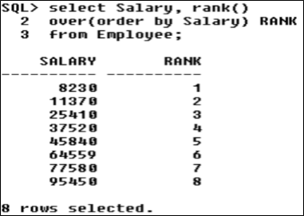

- select EmpNo, DeptNo, Salary, JoinDate, rank() 

over(order by Salary) RANK 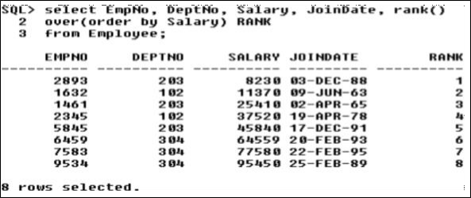from Employee; 

**Output:** 

- **Dense Rank Syntax:**
- select c1, c2, c3 dense\_rank() 

  over(order by c1) DENSE\_RANK from table\_name; 

- **DENSE\_RANK()** is a window function that assigns a rank to each row within a 

partition or result set with no gaps in ranking values. The rank of a row is increased by one from the number of distinct rank values which come before the row. **Query:** 

- select Salary, dense\_rank() 

over(order by Salary) DENSE\_RANK from Employee; 

**Output:** 

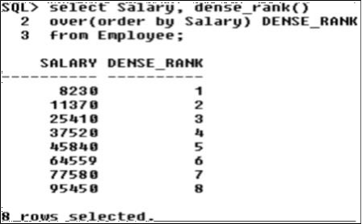

- select EmpNo, DeptNo, Salary, JoinDate, dense\_rank() 

over(order by Salary) DENSE\_RANK from Employee; 

**Output: 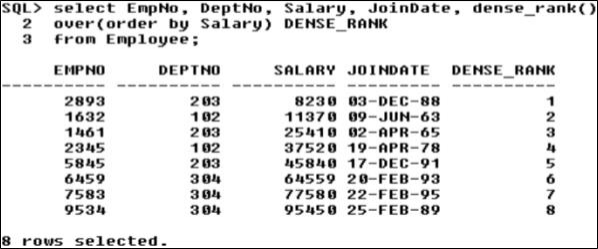**

- **Row\_Number Syntax:**
- select column\_name, row\_number() 

over (order by col) ROW\_NUM from table\_name; 

- **ROW\_NUMBER()** function is a type of function that returns a number for 

each row in sequence or serial, beginning from 1 for the first record of the result set to the end in ascending order. 

**Query:** 

- select EmpNo, row\_number() 

  over (order by Salary) ROW\_NUM from Employee; 

  **Output:** 

  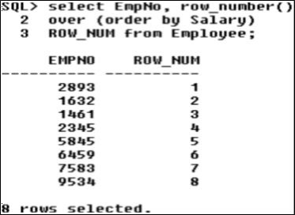

- select EmpNo, DeptNo, Salary, JoinDate, 

row\_number() over (order by Salary) 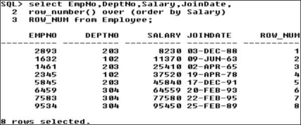ROW\_NUM from Employee; 

**Output:** 

- **LEAD Syntax:** 
- LEAD(<sql expr>, <offset>, <default>) 

OVER(<analytic\_clause>) 

- **LEAD()** function is a window function that allows you to look forward a 

number of rows and access data of that row from the current row. It is very useful for calculating the difference between the current row and the subsequent row within the same result set. 

**Query:** 

- select DeptNo, EmpNo, Salary, 

LEAD(Salary,1,0) 

over(partition by DeptNo order by Salary desc) next\_low\_sal from Employee 

where DeptNo in(203,304) order 

by DeptNo, Salary desc; 

**Output: 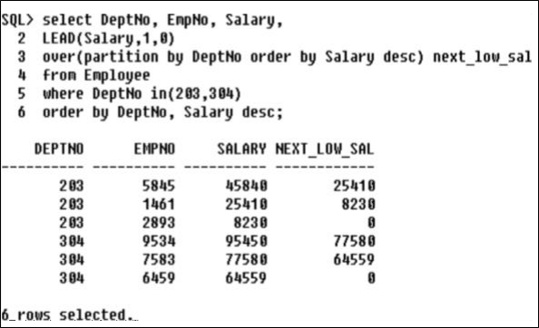**

- **LAG**

**Syntax:** 

- LAG(<sql expr>, <offset>, <default>) 

OVER(<analytic\_clause>) 

- **LAG()** function is a window function that allows you to look back a number of 

rows and access data of that row from the current row. It returns the value of the expression from the row that precedes the current row by offset number of rows within its partition or result set. 

**Query:** 

- select DeptNo, EmpNo, Salary, 

LAG(Salary,1,0) 

over(partition by DeptNo order by Salary desc) next\_high\_sal from Employee 

where DeptNo in(203,304) order 

by DeptNo, Salary desc; 

**Output: 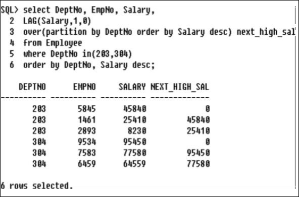**

- **FIRST**

**Syntax:** 

- Function() KEEP(DENSE\_RANK FIRST ORDER BY<expr>)OVER(<partitioning clause>) 
- **FIRST** function is used to return the first value of the selected column. Here, we use limit clause to select first record or more. 

  **Query:** 

- select DeptNo, EmpNo, Salary, 

min(Salary)keep(dense\_rank FIRST order by Salary) over(partition by DeptNo) as lowest 

from Employee 

order by DeptNo,Salary; **Output: 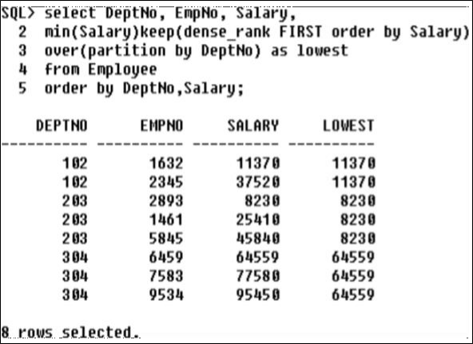**

- **LAST**

**Syntax:** 

- Function() KEEP(DENSE\_RANK LAST ORDER BY<expr>)OVER(<partitioning clause>) 
- **LAST** function is used to return the last value of the selected column. 

**Query:** 

- select DeptNo, EmpNo, Salary, 

min(Salary)keep(dense\_rank LAST order by Salary) over(partition by DeptNo) as highest 

from Employee 

order by DeptNo,Salary; 

**Output: 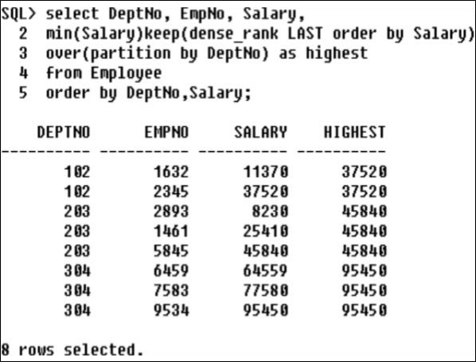**

**Practical No. 4** 

**Aim: Implementation of ORDBMS using ADT (Abstract Data Type), Reference.** 

3) **Abstract Data Type** 
- Create Object Type ‘data\_type1’ with Object Attribute ‘Year’ and Function ‘Prod(Invest number)’, use this function to return the Sum of Year and Invest value. 

**Query:** 

- create type data\_type1 as 

object(Year number, 

member function Prod(Invest number) return number); 

/ 

- create type body data\_type1 is member 

function Prod(Invest number) return number is 

begin return(Year+Invest); 

end; 

end; 

/ 

**Output:** 

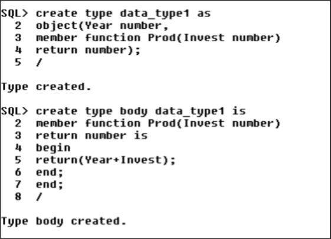

- Create Table ‘Data’ with Attribute ‘Col’ of type ‘data\_type1’. Insert a value in the table. Display the result using Select statement. 

**Query:** 

- create table Data(Col data\_type1); insert 

into Data values(data\_type1(2)); select d.Col.Prod(12) from Data d; 

**Output:** 

- Create Object Type ‘Name’ with Object Attributes ‘FName’ and ‘LName’. Display the First and Last Name of a Person using Table ‘Person’. 

**Query:** 

- create type Name as 

object( 

FName varchar(10), LName varchar(10)); / 

**Output:** 

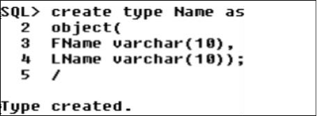

- Creating Table ‘Person’ with Attribute ‘PName’ of type ‘Name’. 
- Inserting values in the table ‘Person’. 
- Displaying the Description of table ‘Person’. 

  **Query:** 

- create table Person(PName Name); 
- insert into Person values(Name('Lekha','Naik')); 
- desc Person; 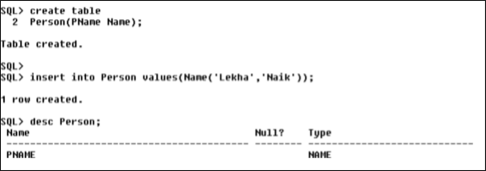

**Output:** 

- Displaying First Name. 
- Displaying First and Last Name. 

  **Query:** 

- select p.PName.FName from Person p; 
- select p.PName.FName || ' ' || p.PName.LName from Person p; **Output:** 

  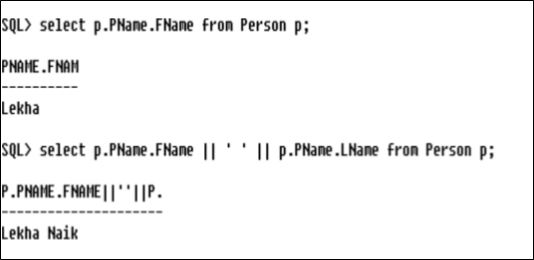

- Create Object Type ‘Address’ with Object Attributes ‘Street’ and ‘City’. Display the Street and City of a person using Table ‘People’, also Display the Person ‘Name’ and ‘DOB’ using ‘Name’ and ‘Date’ Object Type. 

  **Query:** 

- Creating Object Type ‘Address’ with Attributes ‘Street’ and ‘City’: 

  create type Address as object( 

  Street varchar(10), City varchar(10)); / 

- Creating Table ‘People’: 

  create table People(Name Name, Addrs Address, DOB Date); 

- Inserting values in Table: 

  insert into People values(Name('Lekha','Naik'), Address('Mira Road','Thane'), to\_date('02-06-1997','dd-mm-yyyy')); 

  **Output: 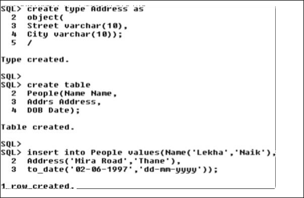**

- Displaying the Table: select \* from People; 
- Displaying the First and Last Name: 

  select pd.Name.FName || ' ' || pd.Name.LName from People pd; 

- Displaying the ‘Street’ and ‘City’: 

  select pd.Addrs.Street || ' ' || pd.Addrs.City from People pd; 

- Displaying the ‘Date of Birth(DOB)’: select DOB from People; 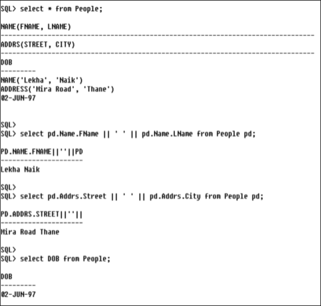

**Output:** 

- Create Object Type ‘Demo’ with Object Attribute ‘ID’ and Function ‘get\_square’. Use this Function to return the Square of ID attribute value. 

  **Query:** 

- Creating Object Type ‘Demo’ with Attribute ‘ID’ and Function ‘get\_square’: 

  create type Demo as object(ID number, 

  member function get\_square return number); 

  / 

- Creating Table ‘Demo\_Tbl’ with Attribute ‘Col’ of type ‘Demo’: 

  create table Demo\_Tbl(Col Demo); 

- Inserting Values in the Table: 

  insert into Demo\_Tbl values(Demo(3)); 

- **Output:** 

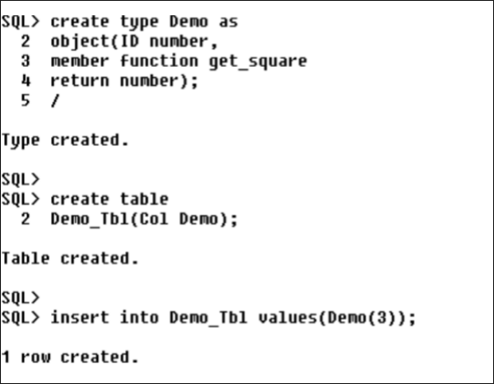

- Creating type body to return the ‘Square of ID’ using ‘get\_square’ function: 

  create type body Demo 

  is member function get\_square return number 

  is n number; 

  begin 

  select s.Col.ID\*s.Col.ID into n from Demo\_Tbl s; 

  return(n); end; 

  end; 

  / 

- Displaying the Square of ID attribute value: 

  select v.Col.get\_square() from Demo\_Tbl v; **Output:** 

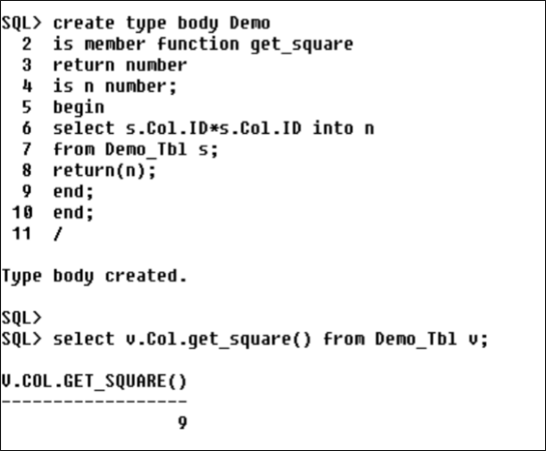

**Aim: Implementation of ETL Transformation with Pentaho.** 

- Transforming Source Table and Storing to Output Table in SQL. **Steps:** 
- Creating a **New Transformation**: 

Open Pentaho Spoon -> File -> New -> Transformation (or CTRL-N) 

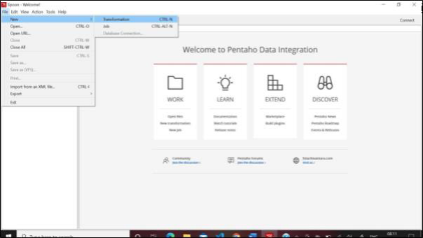

- Inserting **Table Input** into the Transformation: 

Design -> Input -> Table Input (Drag & Drop in Transformation) 

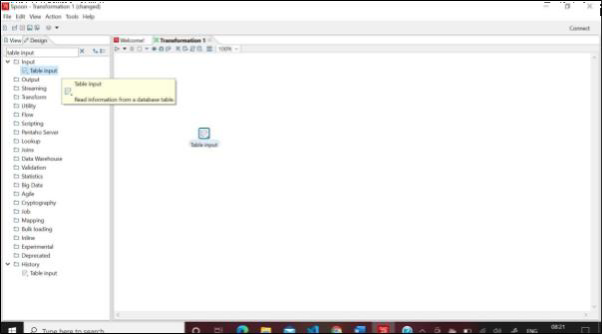

- Establishing **Database Connection**: 

Double Click Table Input -> New -> Enter following respective Details in *General*: Connection name: *conn* Connection Type: *Oracle* Access: *Native (JDBC)* Database Name: *orcl4* Port Number: *1521* Username: *scott* Password: *tiger* Click Test -> OK -> OK 

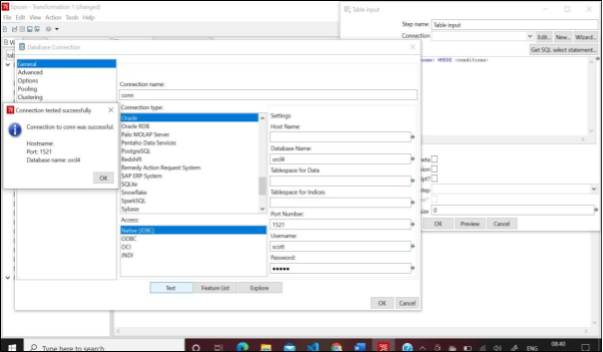

- Getting **Source Table**: 

Table Input -> Get SQL Select Statement -> Data Explorer -> *conn* -> Tables -> *Click on desired Table* -> OK -> Yes 

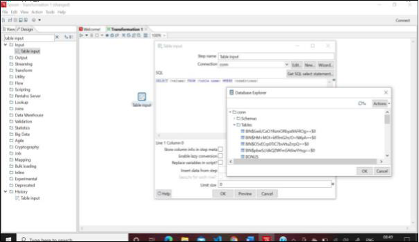

- **View** Input Table: 

Table Input -> Preview -> OK -> Close -> OK 

- Storing to **Output Table**: 

Design -> Output -> Table Output (Drag & Drop in Transformation) -> Create Hop Connection with Output Table (Click on Output Connector arrow in Input Table) 

Double Click Table Output -> Target Table: *output* -> Truncate table ☑ -> Specify database fields ☑ -> Database fields -> Get fields -> SQL -> Execute -> OK -> Close 

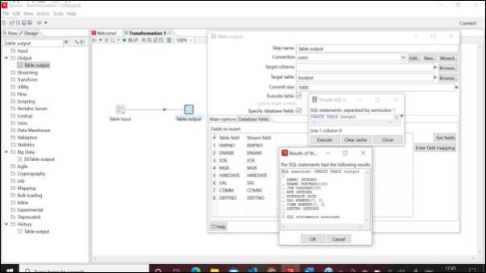

- **Debug** Transformation: 

Click Table Output -> Debug -> Quick Launch -> Yes 

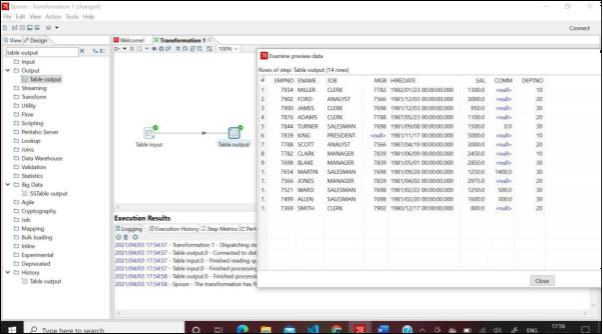

- **View** Output Table in **SQL**: 

SQL Plus -> select \* from output; 

- Implementation of Sorting Operation and Adding Sequence. **Steps:** 
- Creating a **New Transformation**: 

Open Pentaho Spoon -> File -> New -> Transformation (or CTRL-N) 

![ref2]

- Inserting **Table Input** into the Transformation: 

Design -> Input -> Table Input (Drag & Drop in Transformation) 

![ref3]

- Establishing **Database Connection**: 

Double Click Table Input -> New -> Enter following respective Details in *General*: Connection name: *conn* Connection Type: *Oracle* Access: *Native (JDBC)* Database Name: *orcl4* Port Number: *1521* Username: *scott* Password: *tiger* Click Test -> OK -> OK 

![ref4]

- Getting **Source Table**: 

Table Input -> Get SQL Select Statement -> Data Explorer -> *conn* -> Tables -> *Click on desired Table* -> OK -> Yes 

![ref5]

- **View** Input Table: 

Table Input -> Preview -> OK -> Close -> OK 

![ref6]

- **Sorting Operation**: 

  Design -> Transform -> Sort Rows (Drag & Drop in Transformation) -> Create Hop Connection with Sort Rows (Click on Output Connector arrow in Input Table) 

  Double Click Sort Rows -> Only pass unique rows? ☑ -> Get Fields -> Set desired Order in Fields -> OK 

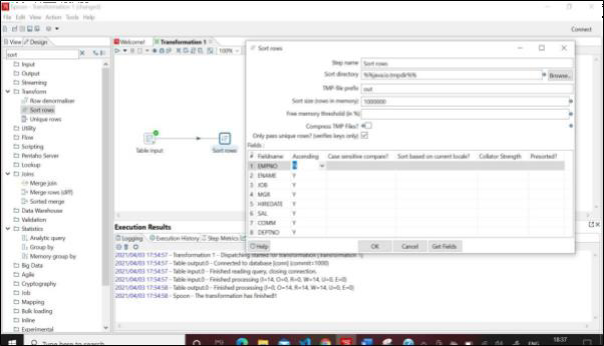

- **Debug** Transformation: 

Click Sort Rows -> Debug -> Quick Launch -> Yes 

- **Adding Sequence**: 

  Design -> Transform -> Add Sequence (Drag & Drop in Transformation) -> Create Hop Connection with Add Sequence (Click on Output Connector arrow in Sort Rows) 

  Double Click Add Sequence -> Start at value: *1* -> Increment by: *2* -> Maximum value: *30* -> OK 

- Storing to **Output Table**: 

Design -> Output -> Table Output (Drag & Drop in Transformation) -> Create Hop Connection with Output Table (Click on Output Connector arrow in Add Sequence) 

Double Click Table Output -> Target Table: *output* -> Truncate table ☑ -> Specify database fields ☑ -> Database fields -> Get fields -> SQL -> Execute -> OK -> Close 

- **Debug** Transformation: 

Click Sort Rows -> Debug -> Quick Launch -> Yes 

- Implementation of Calculator Operation. **Steps:** 
- Creating a **New Transformation**: 

Open Pentaho Spoon -> File -> New -> Transformation (or CTRL-N) 

![ref2]

- Inserting **Table Input** into the Transformation: 

Design -> Input -> Table Input (Drag & Drop in Transformation) 

![ref3]

- Establishing **Database Connection**: 

Double Click Table Input -> New -> Enter following respective Details in *General*: Connection name: *conn* Connection Type: *Oracle* Access: *Native (JDBC)* Database Name: *orcl4* Port Number: *1521* Username: *scott* Password: *tiger* Click Test -> OK -> OK 

![ref4]

- Getting **Source Table**: 

Table Input -> Get SQL Select Statement -> Data Explorer -> *conn* -> Tables -> *Click on desired Table* -> OK -> Yes 

![ref5]

- **View** Input Table: 

Table Input -> Preview -> OK -> Close -> OK 

- **Calculator Operation**: 

  Design -> Transform -> Calculator (Drag & Drop in Transformation) -> Create Hop Connection with Calculator (Click on Output Connector arrow in Input Table) 

  Double Click Calculator -> New field: *Total* -> Calculation: *A+B* -> Field A: *SAL* -> Field B: *MGR* -> Field C: *Total* -> Value type: Number -> Length: *10* -> Remove: N 

  -> OK 

- **Debug** Transformation: 

Click Calculator -> Debug -> Quick Launch -> Yes 

- Storing to **Output Table**: 

Design -> Output -> Table Output (Drag & Drop in Transformation) -> Create Hop Connection with Output Table (Click on Output Connector arrow in Calculator) Double Click Table Output -> Target Table: *output* -> Truncate table ☑ -> Specify database fields ☑ -> Database fields -> Get fields -> SQL -> Execute -> OK -> Close 

- **Debug** Transformation: 

Click Table Output -> Debug -> Quick Launch -> Yes 

- Implementation of Concatenation Operation. **Steps:** 
- Creating a **New Transformation**: 

Open Pentaho Spoon -> File -> New -> Transformation (or CTRL-N) 

![ref2]

- Inserting **Table Input** into the Transformation: 

Design -> Input -> Table Input (Drag & Drop in Transformation) 

![ref3]

- Establishing **Database Connection**: 

Double Click Table Input -> New -> Enter following respective Details in *General*: Connection name: *conn* Connection Type: *Oracle* Access: *Native (JDBC)* Database Name: *orcl4* Port Number: *1521* Username: *scott* Password: *tiger* Click Test -> OK -> OK 

![ref4]

- Getting **Source Table**: 

Table Input -> Get SQL Select Statement -> Data Explorer -> *conn* -> Tables -> *Click on desired Table* -> OK -> Yes 

![ref5]

- **View** Input Table: 

Table Input -> Preview -> OK -> Close -> OK 

![ref6]

- **Concatenation Operation**: 

  Design-> Transform-> Concat Fields (Drag & Drop in Transformation) -> Create Hop Connection with Concat Fields (Click on Output Connector arrow in Input Table) 

  Double Click Concat Fields -> Target Field Name: *Emp\_Data* -> Separator: *\_* -> Get Fields (Discard unwanted Fields) -> OK 

- **Debug** Transformation: 

Click Concat fields -> Debug -> Quick Launch -> Yes 

- Storing to **Output Table**: 

Design -> Output -> Table Output (Drag & Drop in Transformation) -> Create Hop Connection with Output Table (Click on Output Connector arrow in Concat Fields) Double Click Table Output -> Target Table: *output* -> Truncate table ☑ -> Specify database fields 

☑ -> Database fields -> Get fields -> SQL -> Execute -> OK -> Close 

- **Debug** Transformation: 

Click Table Output -> Debug -> Quick Launch -> Yes 

- Implementation of Splitting Operation. **Steps:** 
- Creating a **New Transformation**: 

Open Pentaho Spoon -> File -> New -> Transformation (or CTRL-N) 

![ref2]

- Inserting **Table Input** into the Transformation: 

Design -> Input -> Table Input (Drag & Drop in Transformation) 

![ref3]

- Establishing **Database Connection**: 

Double Click Table Input -> New -> Enter following respective Details in *General*: Connection name: *conn* Connection Type: *Oracle* Access: *Native (JDBC)* Database Name: *orcl4* Port Number: *1521* Username: *scott* Password: *tiger* Click Test -> OK -> OK 

![ref4]

- Getting **Source Table**: 

Table Input -> Get SQL Select Statement -> Data Explorer -> *conn* -> Tables -> *Click on desired Table* -> OK -> Yes 

![ref5]

- **View** Input Table: 

Table Input -> Preview -> OK -> Close -> OK 

- **Splitting Operation**: 

  Design -> Transform -> Split Fields (Drag & Drop in Transformation) -> Create Hop Connection with Split Fields (Click on Output Connector arrow in Input Table) 

  Double Click Split Fields -> Field to split: *ENAME* -> Delimiter: *\_* -> New field: *FName, LName* -> Type: *String* -> Length: *10* -> OK 

- **Debug** Transformation: 

Click Split Fields -> Debug -> Quick Launch -> Yes 

- Storing to **Output Table**: 

Design -> Output -> Table Output (Drag & Drop in Transformation) -> Create Hop Connection with Output Table (Click on Output Connector arrow in Split Fields) Double Click Table Output -> Target Table: *output* -> Truncate table ☑ -> Specify database fields ☑ -> Database fields -> Get fields -> SQL -> Execute -> OK -> Close 

- **Debug** Transformation: 

Click Table Output -> Debug -> Quick Launch -> Yes 

- Implementation of Number Range. **Steps:** 
- Creating a **New Transformation**: 

Open Pentaho Spoon -> File -> New -> Transformation (or CTRL-N) 

![ref2]

- Inserting **Table Input** into the Transformation: 

Design -> Input -> Table Input (Drag & Drop in Transformation) 

![ref3]

- Establishing **Database Connection**: 

Double Click Table Input -> New -> Enter following respective Details in *General*: Connection name: *conn* Connection Type: *Oracle* Access: *Native (JDBC)* Database Name: *orcl4* Port Number: *1521* Username: *scott* Password: *tiger* Click Test -> OK -> OK 

![ref4]

- Getting **Source Table**: 

Table Input -> Get SQL Select Statement -> Data Explorer -> *conn* -> Tables -> *Click on desired Table* -> OK -> Yes 

![ref5]

- **View** Input Table: 

Table Input -> Preview -> OK -> Close -> OK 

- **Number Range**: 

  Design-> Transform-> Number Range(Drag & Drop in Transformation)->Create Hop Connection with Number Range (Click on Output Connector arrow in Input Table) 

  Double Click Number Range -> Input field: *EMPNO* -> Lower Bound: *7301, 7401, 7601, 7801, 7901* -> Upper Bound: *7400, 7600, 7800, 7900, 8000* -> Value: *Interns,* 

  *Officers, Managers, Executives, Retirees* -> OK 

- **Debug** Transformation: 

Click Number Range -> Debug -> Quick Launch -> Yes 

- Storing to **Output Table**: 

Design -> Output -> Table Output (Drag & Drop in Transformation) -> Create Hop Connection with Output Table(Connector arrow Number Range)>Main output of step Double Click Table Output -> Target Table: *output* -> Truncate table ☑ -> Specify 

database fields ☑ -> Database fields -> Get fields -> SQL -> Execute -> OK -> Close 

- **Debug** Transformation: 

Click Table Output -> Debug -> Quick Launch -> Yes 

- Implementation of String Operation. **Steps:** 
- Creating a **New Transformation**: 

Open Pentaho Spoon -> File -> New -> Transformation (or CTRL-N) 

![ref2]

- Inserting **Table Input** into the Transformation: 

Design -> Input -> Table Input (Drag & Drop in Transformation) 

![ref3]

- Establishing **Database Connection**: 

Double Click Table Input -> New -> Enter following respective Details in *General*: Connection name: *conn* Connection Type: *Oracle* Access: *Native (JDBC)* Database Name: *orcl4* Port Number: *1521* Username: *scott* Password: *tiger* Click Test -> OK -> OK 

![ref4]

- Getting **Source Table**: 

Table Input -> Get SQL Select Statement -> Data Explorer -> *conn* -> Tables -> *Click on desired Table* -> OK -> Yes 

![ref5]

- **View** Input Table: 

Table Input -> Preview -> OK -> Close -> OK 

- **String Operations**: 

  Design->Transform->String  Operations(Drag  /  Drop  in  Transformation)->Create  Hop Connection with String Operations (Click on Output Connector arrow in Input Table) 

  Double Click String Operations -> In stream field: *ENAME* -> Lower/Upper: *upper* -> InitCap: *N* -> In stream field: *JOB* -> Trim type: *left* -> Padding: *left* -> Pad char: *\** -> Pad Length: *10* -> InitCap: *Y* ->OK 

- **Debug** Transformation: 

Click String Operations -> Debug -> Quick Launch -> Yes 

- Storing to **Output Table**: 

Design -> Output -> Table Output (Drag & Drop in Transformation) -> Create Hop Connection to Output Table(Connector arrow String Operation)->Main output of step Double Click Table Output -> Target Table: *output* -> Truncate table ☑ -> Specify 

database fields ☑ -> Database fields -> Get fields -> SQL -> Execute -> OK -> Close 

- **Debug** Transformation: 

Click Table Output -> Debug -> Quick Launch -> Yes 

- Importing .CSV file to the target table. **Steps:** 
- Creating a **New Transformation**: 

Open Pentaho Spoon -> File -> New -> Transformation (or CTRL-N) 

![ref2]

- Inserting **CSV File Input** into the Transformation: 

Design -> Input -> CSV File Input (Drag & Drop in Transformation) 

- Importing .**CSV File**: 

  Double Click CSV File Input -> Filename (Browse): *Data.csv* -> Get Fields -> OK -> Preview -> OK -> Close -> OK 

- Storing to **Target Table**: 

  Design -> Output -> Table Output (Drag & Drop in Transformation) -> Create Hop Connection to Output Table (Connector arrow CSV file input) -> Main output of step 

- Establishing **Database Connection**: 

  New -> Enter following respective Details in *General*: 

  Connection name: *conn* Connection Type: *Oracle* Access: *Native (JDBC)* Database Name: *orcl4* Port Number: *1521* Username: *scott* Password: *tiger* Click Test -> OK -> OK 

- Importing to **Target Table**: 

  Double Click Table Output -> Target Table: *output* -> Truncate table ☑ -> Specify database fields ☑ -> Database fields -> Get fields -> SQL -> Execute -> OK -> Close 

- **Debug** Transformation (View Target Table): 

  Click Table Output -> Debug -> Quick Launch -> Yes 

- Implement the Merge Join Transformation on Tables. **Steps:** 
- Creating a **New Transformation**: 

  Open Pentaho Spoon -> File -> New -> Transformation (or CTRL-N) 

![ref2]

- Inserting **Data Grid** into the Transformation: 

  Design -> Input -> Data Grid (Twice Drag & Drop in Transformation) 

- Inserting **Data in Data Grid**: 

  Double Click Data Grids -> Step name : *Employee/ Department* -> Meta: *Enter Fields Details* -> Data: *Enter actual Data* -> OK 

- Inserting **Sort Rows**: 

  Design -> Transform -> Sort Rows (Twice Drag & Drop in Transformation) -> Create Hop Connection with Sort Rows (Click on Output Connector arrow in Data Grids) Double Click Sort Rows -> Get Fields (Discard unwanted Fields) -> OK 

- Inserting **Merge Join** into the Transformation: 

  Design -> Joins -> Merge Join (Drag & Drop in Transformation) -> Create Hop Connection with Merge Join (Click on Output Connector arrow in Sort Rows) 

  Double Click Merge Join -> First Step: *Sort rows* -> Second Step: *Sort Rows 2* -> Join Type: *INNER* -> Get key fields (Both, Discard unwanted Fields) -> OK -> Close 

- **Debug** Transformation: 

  Click Merge Join -> Debug -> Quick Launch -> Yes 

- Implement different Data Validations on Table. **Steps:** 
- Creating a **New Transformation**: 

  Open Pentaho Spoon -> File -> New -> Transformation (or CTRL-N) 

![ref2]

- Inserting **Data Grid** into the Transformation: 

  Design -> Input -> Data Grid (Drag & Drop in Transformation) 

- Inserting **Data in Data Grid**: 

  Double Click Data Grid -> Step name : *Product* -> 

  Meta: *Enter Fields Details* -> Data: *Enter actual Data* -> OK 

- Inserting **Data Validator** into the Transformation: 

  Design -> Validation -> Data Validator (Drag & Drop in Transformation) -> Create Hop Connection with Data Validator (Click on Output Connector arrow in Data Grid) 

  Double Click Data Validator -> Step Name: *Product\_*Validation -> New validation -> Enter validation name: *Product\_Validation* -> OK -> Select a validation to edit: *Click Product\_Validation* -> Name of field to validate: *CheckStatus* -> Data type: *String* -> Add Button -> Enter the allowed value to add: *Shipped* -> OK -> OK 

- Inserting **Dummy** (do nothing) into the Transformation: 

  Design -> Flow -> Dummy (Twice Drag & Drop in Transformation) -> Create Hop Connection with Dummy (Click on Output Connector arrow in Data Validator) -> Dummy: *Main output of step* -> Dummy 2: *Error Handling of Step* -> Copy 

- **Debug** Transformation: 

  Click Data Validator -> Debug -> Quick Launch -> Yes 

**Practical No. 05** 

**Aim: Basic R Commands.** 

- Setting working directory, getting current working directory, listing contents of current working directory. 

  **Commands:** 

- **Setting Working Directory** setwd("C:/Users/Gagan/Documents") 
- **Getting Current Working Directory** 

  getwd() 

- **Listing Contents of Current Working Directory** list.files("C:/Users/Gagan/Documents") 

  **Output:** 

- List Names of Objects in R Environment **Command:** 
- objects()

  **Output:** 

- Different Help Commands **Command:** 
- help(iris) help.search("i") 

  **Output:** 

- Installing Packages (XLConnect, readxl, writexl), Displaying Installed Packages, Loading a Package 

  **Command:** 

- **Installing Packages (XLConnect, readxl, writexl)** 

  install.packages("XLConnect") install.packages("readxl") install.packages("writexl") 

  **Output:** 

- **Displaying Installed Packages** installed.packages() 

  **Output:** 

- **Loading a Package**

  library(XLConnect) library(readxl) library(writexl) 

  **Output:** 

- Creating a Variable, Assigning Values to a Variable, Printing Variable Value **Command:** 
- **Creating a Variable, Assigning Values to a Variable** 

  val<-c (3,5,7,9)  OR 

  assign("vals", c (3,5,7,9))  OR c 

  (3,5,7,9) ->valus 

- **Printing Variable Value** 

  val  #Auto Printing print(vals)  #External Printing 

  **Output:** 

- Performing various Calculations in R (Addition, Subtraction, Multiplication, Division, Square Root, Square, etc..) 

  **Command:** 

- 45+28  #Addition s<-45-28  #Subtraction 

  s 

  4\*5  #Multiplication 8/2  #Division 

sqrt(64)  #Square Root 

8^2   #Square log(2)  #Logarithm exp(8)  #Exponent factorial(5)  #Factorial 

**Output:** 

- Data Types in R (Integer, Numeric, Character, Logical, Complex), Checking 

  Type of a Variable (using typeof() and Class()), Converting a Variable from one type to another. 

  **Command:** 

- i<-45L class(i) n<-4.5 

c<-"word" is.character(c) 

#Integer #Checking Type #Numeric #Character #Checking Type 

l<-T 

typeof(l) 

x<-5+4i con<-as.numeric(i) 

#Logical #CheckingType #Complex #Converting Type 

**Output:** 

- Creating Vectors and Performing Vector Operations. **Command:** 
- v<-c(3,5,8,9)  #Creating  Vector 

  vt<-vector(mode="logical",45) #Creating Vector print(v) #Accessing vector 

  sort.vt<-sort(v,decreasing = TRUE) #Manipulating Vector 

  **Output:** 

- Creating Matrix, using different Methods like matrix(), cbind() and rbind(), Checking 

  Dimension and Attributes of Matrix, Showing Matrix by Row, Performing various Matrix Operations (Mathematical Operations using Scalar Values, Matrix Addition, Subtraction, Multiplication, Division, Transpose of Matrix) 

  **Command:** 

- **Creating Matrix, using different Methods like matrix(), cbind() and rbind()** m<-matrix(c(1,2,3,4,5,6,7,8,9),nrow = 3,ncol = 3)  #Creating Matrix 

  matrix(m) 

  c<-cbind(m1,m2) 

  r<-rbind(m1,m2) 

  **Output:** 

- **Checking Dimension and Attributes of Matrix, Showing Matrix by Row,** 

  **Performing various Matrix Operations** 

  dim(m)  #Dimension 

  attributes(m)  #Attributes mt<-matrix(c(18,24,33,56,65,68,10,26,44),nrow=3,ncol=3,byrow=TRUE)  #By Row m+mt  #Matrix Addition  mt-m  #Matrix Subtraction m\*mt  #Matrix Multiplication  mt/m  #Matrix Division 

t(mt)  #Matrix Transpose 

**Output:** 

- Creating List, Accessing List Element. 

  **Command:** 

- list<-(c("mango","banana","others"))  #Creating List 

  print(list)  #Accessing List print(list[2])  Element 

  **Output:** 

- Creating Factors. **Command:** 
- data <- c ("mango", "West", "pear", "orange", "papaya", "rasberry", "grape", "banana", "apple", "cherry", "jackfruit")  #Creating factors 

  print(data) 

  fact\_data<-factor(data) 

  print(fact\_data) 

  print(is.factor(fact\_data)) 

- **Output:** 

- Creating Data Frames, Checking Number of Rows, Number of Columns, Giving Names to Columns and Rows. 

  **Command:** 

- empid<-c(101,102,103) 

  empnm<-c("rach","pheebs","mon") 

  dtfrm<-data.frame(empid,empnm)  #Creating Data Frame 

  dtfrm 

  nrow(dtfrm)  #Checking Number of Rows ncol(dtfrm)  #Checking Number of Columns names(dtfrm)[1]<-"stdid"  #Giving Names to names(dtfrm)[2]<-"stdnm"  Columns 

  names(dtfrm) 

  **Output:** 

- Creating Table. 

  **Command:** 

- data<-matrix(c(123,234,345,456,567,678,890,901,098),ncol=3,byrow=TRUE) 

  colnames(data)<- c("Sci","Math","Lang") 

  rownames(data)<- c("T1","T1","T3") 

  data<-as.table(data)  #Creating Table data 

  View(data)  #Accessing table 

  **Output:** 

- Reading and Writing Data from .CSV File, Showing Dimensions, Showing First 5 Rows, Showing Last 5 Rows. 

  **Command:** 

- **Reading and Writing Data from .CSV File** 

  cpInfo<-read.csv("Info.csv")  #Reading from .csv write.csv(data,"Info.csv")  #Writing to .csv newInfo<-read.csv("Info.csv") 

  **Output:** 

- **Showing Dimensions, Showing First 5 Rows, Showing Last 5 Rows** cpInfo<-read.csv("Stud.csv")  dim(cpInfo)  #Dimensions 

  dtfrm<-data.frame(cpInfo) 

  head(dtfrm,5)  #First 5 Rows  tail(dtfrm,5)  #Last 5 Rows 

  **Output:** 

  

- Reading and Writing Data from Excel using XLConnect. **Command:** 
- library(XLConnect) 

  xlFile=XLConnect::readWorksheetFromFile("Demo.xlsx",sheet=1) 

  xlFile 

  data=XLConnect::readWorksheetFromFile("About.xlsx",sheet=1) writeFile=XLConnect::writeWorksheetToFile("Demo.xlsx",data,sheet = "About") xlFile=XLConnect::readWorksheetFromFile("Demo.xlsx",sheet="About") 

  xlFile 

  **Output:** 

- Reading and Writing Data from Excel using readXL and writeXL. 

  **Command:** 

- library(readxl)  #Loading ‘readxl’ Package  library(writexl)  #Loading ‘writexl’ 

  xlsmp<-read\_xlsx(“About.xlsx”,sheet=1)  #Reading using readXL wrxl<-write\_xlsx(data,”About.xlsx”)  #Writing using writeXL 

  **Output:** 

**Practical No. 7** 

**Aim: Implementation of Data pre-processing techniques like,** 

- **Naming and Renaming variables, adding a new variable.** 
- **Dealing with missing data.** 
- **Dealing with categorical data.** 
- **Data reduction using sub-setting.** 
- **Naming and Renaming variables, adding a new variable.** 
- my\_data<-mtcars head(mtcars,5) 
  - my\_data<-my\_data[1:6,1:5] 

    require(dplyr) my\_data<-rename(my\_data,horse\_power=hp) my\_data$new\_hp<-my\_data$horse\_power\*0.5 colnames(my\_data) 

- data <- read.table(file="missing\_col.csv", sep = ",") 

  data <- read.table(file="missing\_col.csv", sep = ",",col.names=c("Sno","NAME","SALARY","Date\_Of\_Joining","Department")) data 

- **Dealing with missing data.** 
- Error Detection and Correction NA: Not Available - Known as missing values 
- Works as a place holder for something that is ‘missing’ 
- Most basic operations (addition, subtraction, multiplication, etc.) in R deal with it without crashing and return NA if one of the inputs is NA 
- is.na(VALUE) is used to check if the input value is NA or not. 
- Returns a TRUE/FALSE vector whereas in case of Excel like utilities for numeric computations it’s assumed to be 0 
- **Using na.rm():** This will keep NA rows in data while removes them during calculation 
- e.g. V <- c(1,2,NA,3)  median(V, na.rm = T) 
- **Data reduction using subsetting** 
- **complete.cases()**

Return a logical vector indicating which cases are complete, i.e., have no missing values. Syntax: complete.cases(…) 

It takes a sequence of vectors, matrices and data frames as arguments. E.g. V <- c (1,2,NA,3) 

V [complete.cases(V)]  [1] 1 2 3 

- **is.na()** logical indexing: indicates which elements are missing 
- e.g. naVals <- is.na(V)  V[!naVals]  [1] 1 2 3 

  Detect if there are any NAs: **any**(is.na(datan)) Identify positions of NAs:  **which**(is.na(datan$v1)) 

- **Imputation: The process of estimating or deriving missing values** 

  Missing data imputation is a statistical method that replaces missing data points with substituted values. 

  There are various methods for imputation 

  – Imputation of the mean – Imputation of the median – Imputation using linear regression models 

- Package Hmisc implments many imputation methods 

- library(Hmisc) 

  x = c(1,2,3,NA,4,4,NA) 

  # mean imputation - from package, mention name of function to be used 

- v<-impute(x,fun=mean) v 

- v<-impute(x,fun=median) v 

- v<-impute(data1$SRNO,fun=mean) v 

- v<-impute(data1$SALARY,fun=median) v 

- **Dealing with categorical data.** 
- c1<-c("low","medium","high","medium","low") c1<-factor(c1,levels =c("low","medium","high")) c1 

- **Data reduction using sub-setting.** 
- data1<-read.csv("missing\_col.csv",sep=",",col.names = c("SRNO","NAME","SALARY","DOJ","DEPARTMENT")) 
- View(data1) 

- x<-c(1,2,3,NA,4,NA,5) x 

- xn<-is.na(x) x[!xn] NA+4 

- median(x,na.rm=T) 

- complete.cases(x) 

- is.na(data1) 

- datacompletecases<-data1[complete.cases(data1),] datacompletecases 

- any(is.na(x)) which(is.na(data1$SRNO)) 

- Na.omit(x) 

**Practical No. 7** 

**Aim: Implementation and analysis of Linear regression through graphical methods.** 

- x<-c(3,8,9,13,3,6,11,21,1,16) 

  #response variable y<-c(30,57,64,72,36,43,59,90,20,83) plot(x,y) 

- plot(x,y, col='red',main="scatter plot") 

- **Linear Regression Model** 
- model=lm(y~x)

model 

- attributes(model)

  coef(model) residuals(model) 

- summary(model)

- abline(model) 

- **Predicting values manually y=a+bx** 
- x10<-model$coefficients[[1]]+model$coefficients[[2]]\*10 x10 

- **Using Predict ()** 
- a<-data.frame(x=10) a pred<-predict(model,a) pred 

- plot(model) 

**Practical No. 8** 

**Aim: Implementation and analysis of Classification algorithms like Naive Bayesian, K-Nearest Neighbour.** 

- **Naive Bayesian** 
- View(iris) 

  

- ir=iris train=ir[1:100,] train 

- test=ir[101:150,] test 

- model=naiveBayes(Species ~.,data=train) 

model 

- test$Species 

- train$Species 

- pred=predict(model,test) 

table(pred) table(test$Species) table(train$Species) 

- **Shuffle Iris File** 
- ir1=ir[sample(nrow(ir)),] View(ir1) 

- train=ir1[1:100,] 

test=ir1[101:150,] model=model=naiveBayes(Species ~.,data=train) pred=predict(model,test) 

table(pred) 

- table(train$Species) table(test$Species) 

- **K-Nearest Neighbour** 
- table(iris$Species) 

  str(iris$Species) head(iris) 

- ir1=ir[sample(nrow(ir)),] head(ir1) 

- normalize<-function(x){ 

return((x-min(x)/(max(x)-min(x)))) 

} iris\_n<-as.data.frame(lapply(ir1[,c(1,2,3,4)],normalize)) str(iris\_n) 

- iris\_train<-iris\_n[1:129,] 

iris\_test<-iris\_n[130:150,] iris\_train\_target<-iris[1:129,5] iris\_test\_target<-iris[130:150,5] iris\_train\_target 

- dim(iris\_train) 

dim(iris\_test) model<-knn(iris\_train,iris\_test,cl=iris\_train\_target,k=13) model table(iris\_test\_target,model) 

**Practical No. 9** 

**Aim: Implementation and analysis of Apriori Algorithm using Market Basket Analysis.** 

- mba\_data<-read.csv("data\_apriori.csv") View(mba\_data) 

- class(mba\_data) 

- **Method 1: Convert Data Frame into Transactions** 
- t<-as(mba\_data,"transactions") 

class(t) inspect(t) 

- **Method 2: Convert Data Frame into Transactions** 
- trans<-split(mba\_data$Customer\_Id,mba\_data$Products,"transactions") trans 

- class(trans) 

- trans<-split(mba\_data$Products,mba\_data$Customer\_Id,"transactions") head(trans) 

- rules<-apriori(trans,parameter = list(support=0.5,confidence=0.9,maxlen=3,minlen=2)) 

- rules

- inspect(head(rules,n=3, by="lift")) summary(rules) 

- plot(rules) 

- data("Groceries") inspect(head(Groceries,3)) 

- View(Groceries) 

- rules<-apriori(Groceries,parameter = list(support=0.01,confidence=0.09,maxlen=3,minlen=2)) 

- rules

**Practical No. 10** 

**Aim: Implementation and Analysis of Clustering Algorithms like K-Means, Agglomerative.** 

- **K-Means**
- mydata<-select(iris,c(1,2,3,4)) model<-kmeans(mydata,3) model 

- model$size table(model$cluster,iris$Species) 

- model$cluster<-as.factor(model$cluster) ggplot(iris,aes(Petal.Length,Petal.Width,color=model$cluster))+geom\_point() 

- **Agglomerative** 
- df<-USArrests View(df) 

- **Pre-processing** 
- #Remove NA Values 

df<-na.omit(df) df 

- #scale (normalizing or Standadizing) 

d<-scale(df) head(d) 

- d<-dist(d,method = "euclidean") 

hc<-hclust(d,method = "complete") plot(hc) 

- plot(hc,cex=0.1,hang=-1) 

- hc<-hclust(dist(d)) plot(hc) 

- hcd=as.dendrogram(hc) 

plot(hcd,type="triangle") 

- plot(cut(hcd,h=75)$upper) 

- plot(cut(hcd,h=75)$lower[[2]]) 

[ref1]: Aspose.Words.b079c49b-f542-4b61-aa2e-eed24adb5cc4.021.png
[ref2]: Aspose.Words.b079c49b-f542-4b61-aa2e-eed24adb5cc4.055.png
[ref3]: Aspose.Words.b079c49b-f542-4b61-aa2e-eed24adb5cc4.056.png
[ref4]: Aspose.Words.b079c49b-f542-4b61-aa2e-eed24adb5cc4.057.png
[ref5]: Aspose.Words.b079c49b-f542-4b61-aa2e-eed24adb5cc4.058.png
[ref6]: Aspose.Words.b079c49b-f542-4b61-aa2e-eed24adb5cc4.059.png
